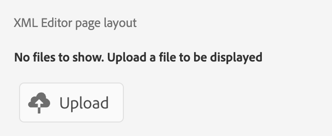
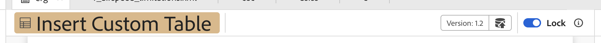

# Ökning

När du migrerar från det gamla användargränssnittet till det nya användargränssnittet i AEM Guides måste uppdateringar av **ui_config** konverteras till mer flexibla och modulära användargränssnittskonfigurationer. Med det här ramverket kan du implementera ändringar sömlöst i **editor_toolbar** och [andra verktygsfält](/help/courses/course-3/conver-ui-config.md#editing-json-for-different-screens). Processen har även stöd för att ändra andra vyer och widgetar i programmet.

>[!NOTE]
>
>Anpassningar som tillämpas på specifika knappar kan stöta på problem under övergången till tilläggsramverket. Om detta inträffar kan du göra en supportanmälan med en referens till den här sidan för snabb support och lösning.

## Redigera JSON för olika skärmar

JSON-filer kan läggas till i konfigurationsavsnittet för XML-redigerarens användargränssnitt för olika skärmar och widgetar. Nedan finns en lista över widgetar som används ofta och deras ID:n:

1. [editor_toolbar](assets/toolbars/editor_toolbar.json): Verktygsfältet Webbredigerare som består av fil- och innehållsåtgärder.
1. [editor_tab_bar](assets/toolbars/editor_tab_bar.json): I flikvyn med öppna filer i webbredigeraren finns åtgärder som du kan utföra på öppna filer.
1. [file_mode_switch](assets/toolbars/file_mode_switcher.json): Det hjälper dig att växla mellan olika tillgängliga lägen (författare, källa, förhandsgranskning) för de öppnade filerna i webbadministratören.

   

1. [map_console_navigation_bar](assets/toolbars/map_console_navigation_bar.json): Det är informationsfältet för kartan som öppnas i kartkonsolen. Det gör det möjligt att ändra kartan och ger åtkomst till inställningarna.
1. [map_console_action_bar](assets/toolbars/map_console_action_bar.json): Det här är åtgärdsfältet för mappningskonsolobjekt som Utdatainställning, Baslinje, Översättning och Rapporter, som innehåller relevant information tillsammans med respektive åtgärdsknapp.

   

1. [home_navigation_bar](assets/toolbars/home_navigation_bar.json): Huvudfältet på startsidan för guider där välkomstmeddelandet visas tillsammans med den valda mappprofilen.

   

<br>

## Allmän struktur för varje JSON

Varje JSON följer en konsekvent struktur:

1. `id`: Anger widgeten där komponenten anpassas.
1. `targetEditor`: Definierar när en knapp ska visas eller döljas med redigerings- och lägesegenskaper:

   Följande alternativ stöds under `targetEditor`:

   - `mode`
   - `displayMode`
   - `editor`
   - `documentType`
   - `documentSubType`
   - `flag`

   Mer information finns i [Om egenskaper för targetEditor](#understanding-targeteditor-properties)

   >[!NOTE]
   >
   > I version 2506 av Experience Manager Guides introduceras nya egenskaper: `displayMode`, `documentType`, `documentSubType` och `flag`. Dessa egenskaper stöds endast från version 2506 och framåt. På samma sätt gäller ändringen från `toc` till `layout` i mode-egenskapen från och med den här versionen.
   >
   > Ett nytt fält, `documentType`, är nu tillgängligt tillsammans med det befintliga `editor`-fältet.  Båda fälten stöds och kan användas efter behov. Vi rekommenderar dock att du använder `documentType` för att säkerställa konsekvens mellan implementeringar, särskilt när du arbetar med egenskapen `documentSubType`. Fältet `editor` är fortfarande giltigt för att stödja bakåtkompatibilitet och befintliga integreringar.


1. `target`: Anger var den nya komponenten ska läggas till. Detta använder nyckelvärdepar eller index för unik identifiering. Visa lägen:

   - **append**: Lägg till i slutet.

   - **prepend**: Lägg till i början.

   - **replace**: Ersätt en befintlig komponent.

Exempel på JSON-struktur:

```json
{
  "id" : "editor_toolbar",
  "view": {
    "items": [
      {
        ...,
        "targetEditor": {
          "mode": [
            "preview"
          ],
          "editor": [
            "xml"
          ]
        },
        "target": {
          "key": "label",
          "value": "Table",
          "viewState": "prepend"
        },
        ...
      },
    ]
  }
}
```

<br>

## Egenskaper för `targetEditor`

Nedan visas en beskrivning av varje egenskap, dess syfte och vilka värden som stöds.

### `mode`

Definierar redigerarens driftläge.

**Värden som stöds**: `author`, `source`, `preview`, `layout` (tidigare `toc`), `split`

### `displayMode` *(valfritt)*

Styr synlighet eller interaktivitet för UI-komponenter. Standardvärdet är `show` om det inte anges.

**Värden som stöds**: `show`, `hide`, `enabled`, `disabled`

Exempel:

```
 {
        "icon": "textBulleted",
        "title": "Custom Insert Bulleted",
        "on-click": "$$AUTHOR_INSERT_REMOVE_BULLETED_LIST",
        "key": "$$AUTHOR_INSERT_REMOVE_BULLETED_LIST",
        "targetEditor": {
          "documentType": [
            "ditamap"
          ],
          "mode": [
            "author"
          ],
          "displayMode": "hide"
        }
      },
```

### `editor`

Anger den primära dokumenttypen i redigeraren.

**Värden som stöds**: `ditamap`, `bookmap`, `subjectScheme`, `xml`, `css`, `translation`, `preset`, `pdf_preset`

### `documentType`

Anger den primära dokumenttypen.

**Värden som stöds**: `dita`, `ditamap`, `bookmap`, `subjectScheme`, `css`, `preset`, `ditaval`, `reports`, `baseline`, `translation`, `html`, `markdown`, `conditionPresets`

> Ytterligare värden kan stödjas för specifika användningsfall.

Exempel:

```
 {
        "icon": "textNumbered",
        "title": "Custom Numbered List",
        "on-click": "$$AUTHOR_INSERT_REMOVE_NUMBERED_LIST",
        "key": "$$AUTHOR_INSERT_REMOVE_NUMBERED_LIST",
        "targetEditor": {
          "documentType": [
            "dita",
            "ditamap"
          ],
          "mode": [
            "author",
            "source"
          ]

        }
      },
```

### `documentSubType`

Klassificerar dokumentet ytterligare baserat på `documentType`.

- **För`preset`**: `pdf`, `html5`, `aemsite`, `nativePDF`, `json`, `custom`, `kb`
- **För`dita`**: `topic`, `reference`, `concept`, `glossary`, `task`, `troubleshooting`

> Ytterligare värden kan stödjas för specifika användningsfall.

Exempel:

```
 {
        "icon": "rename",
        "title": "Custom Rename",
        "on-click": "$$PUBLISH_PRESETS_RENAME",
        "label": "Custom Rename",
        "key": "$$PUBLISH_PRESETS_RENAME",
        "targetEditor": {
          "documentType": [
            "preset"
          ],
          "documentSubType": [
            "nativePDF",
            "aemsite",
            "json"
          ]

        }
      },
```

### `flag`

Booleska indikatorer för dokumentstatus eller -funktioner.

**Värden som stöds**: `isOutputGenerated`, `isTemporaryFileDownloadable`, `isPDFDownloadable`, `isLocked`, `isUnlocked`, `isDocumentOpen`

Dessutom kan du skapa en anpassad flagga inuti `extensionMap` som används som flagga i `targetEditor`. Här är `extensionMap` en global variabel som används för att lägga till anpassade nycklar eller observerbara värden.

Exempel:

```
 {
        "icon": "filePDF",
        "title": "Custom Export pdf",
        "on-click": "$$DOWNLOAD_TOPIC_PDF",
        "key": "$$DOWNLOAD_TOPIC_PDF",
        "targetEditor": {
          "documentType": [
            "markdown"
          ],
          "mode": [
            "preview"
          ],
          "flag": ["isPDFDownloadable"]

        }
      },
```


## Exempel

Nedan visas ett exempel på hur du lägger till, tar bort eller ersätter en knapp i redigeringsverktygsfältet.

### Lägga till en knapp

Lägger till en ny knapp, **Infoga anpassad tabell** i **editor_toolbar**, för att lägga till en enkel tabell som bara visas i förhandsgranskningsläget.

```json
{
  "id": "editor_toolbar",
  "view": {
    "items": [
      {
        "icon": "table",
        "title": "Insert Custom Table",
        "on-click": {
          "name": "$$AUTHOR_INSERT_ELEMENT",
          "args": [
            "simpletable",
            "table",
            "choicetable"
          ]
        },
        "key": "$$AUTHOR_INSERT_ELEMENT",
        "targetEditor": {
          "mode": [
            "preview"
          ],
        },
        "target": {
          "key": "label",
          "value": "Table",
          "viewState": "prepend"
        }
      }
    ]
  }
}
```


### Ta bort en knapp

Ta bort en knapp från verktygsfältet. Här tar vi bort knappen Lägg till bild från redigeringsverktygsfältet.

```json
{
  "id": "editor_toolbar",
  "view": {
    "items": [
      {
        "hide": true,
        "target": {
          "key": "label",
          "value": "Image",
          "viewState": "replace"
        }
      }
    ]
  }
}
```

### Ersätta en knapp

Ersätter knappen **Multimedia** från verktygsfältet med infogningsknappen **YouTube** som bara är synlig i redigeringsläge.

```json
{
  "id": "editor_toolbar",
  "view": {
    "items": [
      {
        "icon": "s2youtube",
        "title": "Youtube",
        "on-click": {
          "name": "$$AUTHOR_INSERT_ELEMENT",
          "args": "<object data='http://youtube.com'></object>"
        },
        "targetEditor": {
          "mode": [
            "author"
          ]
        },
        "target": {
          "key": "elementId",
          "value": "toolbar-multimedia",
          "viewState": "replace"
        }
      }
    ]
  }
}
```


<br>

### Lägga till en knapp i förhandsgranskningsläge

I enlighet med designen hanteras knappens synlighet separat för låsta och olåsta (skrivskyddade) lägen för att upprätthålla en tydlig och kontrollerad användarupplevelse. Som standard döljs alla nytillagda knappar när gränssnittet är skrivskyddat.
Om du vill göra en knapp synlig i **skrivskyddat**-läge måste du ange ett mål som placerar den i ett underavsnitt i verktygsfältet som är tillgängligt även när gränssnittet är låst.
Om du till exempel anger målet som **Hämta som PDF** kan du se till att knappen visas i samma avsnitt som en befintlig synlig knapp och på så sätt göra den tillgänglig i olåst läge.

```json
"target": {
  "key": "label",
  "value": "Download as PDF",
  "viewState": "prepend"
}
```

Lägger till knappen **Exportera som PDF** i läget **Förhandsgranska** som visas både i lås- och upplåsningsläge.

```json
{
  "id": "editor_toolbar",
  "view": {
    "items": [
      {
        "icon": "filePDF",
        "title": "Export as PDF",
        "on-click": "$$DOWNLOAD_TOPIC_PDF",
        "key": "$$DOWNLOAD_TOPIC_PDF",
        "targetEditor": {
          "editor": [
            "ditamap",
            "xml"
          ],
          "mode": [
            "preview"
          ]
        },
        "target": {
          "key": "label",
          "value": "Download as PDF",
          "viewState": "prepend"
        }
      },
      {
        "icon": "filePDF",
        "title": "Export as PDF",
        "on-click": "$$DOWNLOAD_TOPIC_PDF",
        "key": "$$DOWNLOAD_TOPIC_PDF",
        "targetEditor": {
          "editor": [
            "ditamap",
            "xml"
          ],
          "mode": [
            "preview"
          ]
        }
      }
    ]
  }
}
```

I följande utdrag visas knappen **Exportera som PDF** med ett låsscenario.


Knappen **Exportera som PDF** med upplåsningsscenariot visas i utdraget nedan.


## Så här överför du anpassade JSON-konfigurationer

1. På fliken **XML-redigerarkonfiguration** klickar du på **Redigera** i det övre fältet.
1. I underavsnittet **Användargränssnittskonfiguration för XML-redigering** kan du nu se en **överförings**-knapp.

   {width="400" height="150"}

1. Du kan klicka på och överföra den ändrade JSON-filen. (JSON som ska överföras ska ha samma namn som ID:t för widgeten som anpassas)
1. Tryck på **Spara** i det övre fältet när du har överfört filen.

   För varje överförd fil kan du även **ta bort** json för att ta bort dess anpassning från användargränssnittet eller **hämta** för att visa eller ändra den igen.

   {width="400" height="150"}

<br>


## Så här överför du anpassad CSS

Du kan också lägga till CSS för att anpassa utseendet på anpassade knappar som lagts till eller befintliga widgetar eller knappar i användargränssnittet.

För en nytillagd anpassad knapp lägger du till en **extraclass** i en anpassad knapp eller komponent inuti JSON.
För en gammal klass kan du inspektera element och ändra befintliga klasser också.

```json
{
  "icon": "table",
  "title": "Insert Custom Table",
  "extraclass": "custom-css",
  "key": "$$AUTHOR_INSERT_ELEMENT",
  "targetEditor": {
    "mode": [
      "preview"
    ],
  },
  "target": {
    "key": "label",
    "value": "Table",
    "viewState": "prepend"
  }
}
```

1. På fliken **XML-redigerarkonfiguration** klickar du på **Redigera** i det övre fältet.
1. I **XML-redigerarens sidlayout** kan du nu se en **överförings**-knapp.

   {width="400" height="150"}

1. Du kan klicka och överföra de ändrade CSS-filerna. (Endast CSS-filer stöds)
1. Tryck på **Spara** i det övre fältet när du har överfört filen.

   För varje överförd fil kan du även **ta bort** css för att ta bort dess anpassning från användargränssnittet eller **hämta** för att visa eller ändra den igen.

   {width="400" height="150"}


<br>

### Exempel på hur du anpassar knappar

Här lägger vi till den nya knappen **Infoga anpassad tabell** i **editor_toolbar** för att lägga till en enkel tabell som bara är synlig i förhandsgranskningsläge och använda en anpassad CSS på den.
Denna CSS ändrar bakgrunden för knappen och teckensnittsstorleken för titeln.




```css
#editor_toolbar {
  .custom-css {
    background-color: burlywood;
    font-size: 2rem;  
  }
}
```

```json
{
  "id": "editor_toolbar",
  "view": {
    "items": [
      {
        "icon": "table",
        "title": "Insert Custom Table",
        "extraclass": "custom-css",
        ...
      }
    ]
  }
}
```

<br>

## Steg för att konvertera UI-konfigurationen till modulär Json

1. Klicka på ikonen [!UICONTROL **Verktyg**] på navigeringsskärmen.

   

1. Välj **Stödlinjer** på den vänstra panelen.

1. Klicka på panelen [!UICONTROL **Mappprofiler**].

   

1. Välj en mappprofil.

1. Klicka på fliken [!UICONTROL **XML-redigerarkonfiguration**].

1. Du kan klicka på knappen **Konvertera gränssnittskonfiguration till JSON** . Detta genererar **editor_toolbar** och **map_console_action_bar** json som innehåller ändringarna som gjorts i **ui_config**.

   

1. Du kan checka ut exempelgenererade jons för [redigeringsverktygsfältet](assets/editor_toolbar.json) och [kartkonsolens åtgärdsfält](assets/map_console_action_bar.json)


>[!NOTE]
>
>Ändringar som görs i avsnitten **verktygsfält** och **verktygsfält** läggs till i **editor_toolbar** json, som visas på redigeringssidan. De ändringar som görs för knappar som är relaterade till förinställningar eller översättning i **ui_config** läggs till i **map_console_action_bar** json, som kan visas på sidan Kartkonsol.
