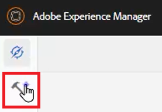

# Konfiguration av XML-redigerare

Om du arbetar i en restriktiv miljö kan du välja vilka funktioner författarna kan se genom att anpassa redigerarkonfigurationen i en viss mappprofil. Om du använder den här mappprofilen kan du ändra utseendet på själva redigeraren, CSS-mallarna, tillgängliga fragment och etiketterna för innehållsversionen.

Exempelfiler som du kan välja att använda för den här lektionen finns i filen [xmleditorconfiguration.zip](assets/xmleditorconfiguration.zip).

>[!VIDEO](https://video.tv.adobe.com/v/342762?quality=12&learn=on)

## Anpassa standardkonfigurationen för redigeringsgränssnittet

Du kan alltid hämta standardgränssnittskonfigurationen till din lokala dator, göra ändringar i den i valfri textredigerare och sedan överföra den igen.

1. Klicka på ikonen [!UICONTROL **Verktyg**] på navigeringsskärmen.

   

1. Välj **Stödlinjer** på den vänstra panelen.

1. Klicka på panelen [!UICONTROL **Mappprofiler**].

   

1. Välj en mappprofil.

1. Klicka på fliken [!UICONTROL **XML-redigerarkonfiguration**].

1. Klicka på [!UICONTROL **Hämta**] som standard.

   

Du kan nu öppna och ändra innehållet i en textredigerare. _AEM Guides installations- och konfigureringshandbok_ innehåller exempel på hur du tar bort, anpassar eller lägger till funktioner i gränssnittskonfigurationen.

## Överför den ändrade konfigurationen för XML-redigeraren

När du har anpassat gränssnittskonfigurationen kan du överföra den. Observera att en exempelkonfigurationsfil _ui-config-restricted-editor.json_ innehåller en uppsättning stödavsnitt för den här lektionen.

1. Klicka på fliken [!UICONTROL **XML-redigerarkonfiguration**] i mappprofilen.

1. Klicka på [!UICONTROL **Överför**] under konfigurationen för XML-redigeraren.

   

1. Dubbelklicka på filen för den ändrade användargränssnittskonfigurationen, eller så som visas här, den medföljande exempelfilen.

   

1. Klicka på [!UICONTROL **Spara**] i skärmens övre vänstra hörn.

Den ändrade gränssnittskonfigurationen har överförts.

## Anpassa CSS-mallayouten

Precis som med gränssnittskonfigurationen kan du hämta CSS-mallayouten. Du kan öppna det i en textredigerare och göra ändringar för att anpassa utseendet på ämnet innan du överför det.

1. Klicka på ikonen [!UICONTROL **Verktyg**] på navigeringsskärmen.

   

1. Välj **Stödlinjer** på den vänstra panelen.

1. Klicka på panelen [!UICONTROL **Mappprofiler**].

   

1. Välj en mappprofil.

1. Klicka på fliken [!UICONTROL **XML-redigerarkonfiguration**].

1. Klicka på [!UICONTROL **Hämta**] under CSS-mallayout.

   

Nu kan du ändra och spara CSS-innehållet i en textredigerare.

## Överför den ändrade CSS-mallayouten

När du har anpassat CSS-mallayouten kan du överföra den. Observera att en exempelfil _css-layout-ONLY-draft-comment-change.css_ innehåller en uppsättning stödavsnitt för den här lektionen. Den här filen innehåller bara ändringen av utkastkommentarer, medan _css-layout-draft-comment-change.css_ är hela filen, som endast är tillgänglig för testning eller granskning.

1. Klicka på fliken [!UICONTROL **XML-redigerarkonfiguration**] i mappprofilen.

1. Klicka på [!UICONTROL **Överför**] under CSS-mallayout.

   

1. Dubbelklicka på filen för din egen anpassade CSS-layout eller den exempelfil som visas här.

   

1. Klicka på [!UICONTROL **Spara**] i skärmens övre vänstra hörn.
Den anpassade CSS-mallayouten har överförts.

## Redigera XML-redigerarkodfragment

Kodavsnitt är återanvändbara innehållsdelar som kan vara specifika för en produkt eller grupp. Observera att exempelfragmenten finns med i supportfilerna för den här lektionen.

1. Klicka på ikonen [!UICONTROL **Verktyg**] på navigeringsskärmen.

   

1. Välj **Stödlinjer** på den vänstra panelen.

1. Klicka på panelen [!UICONTROL **Mappprofiler**].

   

1. Välj en mappprofil.

1. Klicka på fliken [!UICONTROL **XML-redigerarkonfiguration**].

1. Klicka på **Överför** under XML-redigeringsfragment.

   

1. Välj egna fragment eller använd de medföljande exemplen.

   

1. Klicka på [!UICONTROL **Spara**] i skärmens övre vänstra hörn.

Du har lagt till nya fragment i redigeraren.

## Anpassa versionsetiketter för XML-innehåll

Som standard kan författare skapa egna etiketter och associera dem med ämnesfiler. Detta kan leda till olika variationer på samma etikett. För att undvika inkonsekventa etiketter kan du även välja i listor med fördefinierade etiketter.

1. Klicka på ikonen [!UICONTROL **Verktyg**] på navigeringsskärmen.

   

1. Välj **Stödlinjer** på den vänstra panelen.

1. Klicka på panelen [!UICONTROL **Mappprofiler**].

   

1. Välj en mappprofil.

1. Klicka på fliken [!UICONTROL **XML-redigerarkonfiguration**].

1. Klicka på [!UICONTROL **Hämta**] under Etiketter för XML-innehållsversion.

   

Nu kan du anpassa etiketterna efter behov.

## Ladda upp versionsetiketter för XML-innehåll

När du har laddat ned och ändrat etiketterna kan du ladda upp avsnittet XML Content Version Label. Du kan välja att använda exempelfilen _labels.json_, som finns med i uppsättningen med stödavsnitt för den här lektionen.

1. Klicka på fliken [!UICONTROL **XML-redigerarkonfiguration**] i mappprofilen.

1. Klicka på [!UICONTROL **Överför**] under Versionsetiketter för XML-innehåll.

   

1. Dubbelklicka på filen för antingen egna etiketter eller exempelfilen som visas här.

   

1. Klicka på [!UICONTROL **Spara**] i skärmens övre vänstra hörn.

Du har överfört anpassade versionsetiketter för XML-innehåll.
