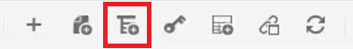

# Kartor och bokkartor

Med Adobe Experience Manager Guides kartredigerare kan du skapa och redigera kartfiler. Med Kartredigeraren kan du redigera två typer av filer - DITA-karta och bokkarta. För våra syften bör dessa anses vara i stort sett utbytbara begrepp.
Kartredigeraren finns i två lägen - den grundläggande kartredigeraren och den avancerade karteditorn.

>[!VIDEO](https://video.tv.adobe.com/v/342766?quality=12&learn=on)

## Skapa en karta

AEM Guides har två färdiga mallar för kartor - DITA-karta och bokkarta. Du kan också skapa egna mappningsmallar och dela dem med författarna för att skapa mappningsfiler.

Utför följande steg för att skapa en kartfil.

1. Gå till den plats där du vill skapa kartfilen i Assets-användargränssnittet.

1. Klicka på [!UICONTROL **Skapa > DITA-karta**].

1. På sidan Design väljer du den typ av kartmallar som du vill använda och klickar på [!UICONTROL **Nästa**].

1. Ange en **titel** och **namn** för kartan på sidan Egenskaper.

1. Klicka på [!UICONTROL **Skapa**].

## Öppna en karta med Avancerad kartredigerare

1. I **Assets-gränssnittet** väljer du kartan som ska redigeras.

1. Klicka på [!UICONTROL **Redigera ämnen**].

   

eller

1. Håll muspekaren över kartikonen.

1. Välj **Redigera ämnen** på menyn **Åtgärd**.

## Lägga till innehåll i en karta eller bokmapp

1. Navigera till **databasvyn**.

1. Dra och släpp innehåll från databasvyn till giltiga platser på kartan eller bokmappen.

eller

1. Klicka på en giltig plats på kartan eller bokmappen.

1. Klicka på lämplig [!UICONTROL **verktygsfältsikon**] för att lägga till kapitel, ämnen eller ämnesreferenser.

   

1. Välj en eller flera Assets som du vill lägga till.

1. Klicka på [!UICONTROL **Markera**].

### Befordra eller nedgradera element på en karta

Använd **verktygsfältspilarna** för att befordra eller nedgradera kapitel och ämnesreferenser i en karta eller bokmapp.

1. Markera ett element på kartan.

1. Klicka på [!UICONTROL **vänsterpilen**] om du vill höja upp en topicref till ett kapitel eller på [!UICONTROL **högerpilen**] om du vill sänka ned ett kapitel till en topicref.

   

1. Spara och versionshantera kartan om det behövs.

eller

1. Dra och släpp element för att ordna om dem.

## Lägga till metadata i en karta

1. Infoga en ämnesgrupp i **kartverktygsfältet**.

   

1. Klicka på [!UICONTROL **plusikonen**] för att infoga element.

1. Välj de element som ska infogas.

   

1. Klicka på [!UICONTROL **Stäng**].

## Lägga till en relativ till en karta

Du kan lägga till en relativ när en karta har strukturerats.

1. Klicka på den plats på kartan där du vill infoga den relaterade tabellen.

1. Använd **verktygsfältsikonen** för att lägga till den relaterade tabellen på kartan.

   

1. Konfigurera dialogrutan.

1. Klicka på [!UICONTROL **Infoga**].

1. Dra och släpp obligatoriska ämnen från **databasen** till den relaterade tabellen.

1. Kopiera och klistra in nödvändiga element från kartan i den relaterade tabellen med standardkortkommandon.

## Tilldela attribut till ämnesreferenser på en karta

1. Markera en topicref-samling eller en kapslad samling med topicrefs på kartan.

1. Välj ett **Attribut** och dess **värde under Andra attribut på panelen Innehållsegenskaper.**

   
