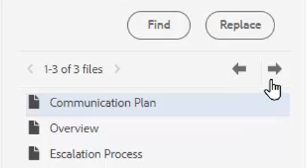

# Stavningskontroll och sök/ersätt

AEM Guides Editor har kraftfulla funktioner för stavningskontroll och Sök och ersätt.

>[!VIDEO](https://video.tv.adobe.com/v/342768?quality=12&learn=on)

Korrigera ett stavfel

1. Leta upp ett fel i ett öppet ämne som visas med en röd understrykning.

1. Håll ned Ctrl och klicka på den andra musknappen i ordet.

1. Välj rätt stavning bland förslagen.

Om rätt stavning inte föreslås kan du alltid redigera ordet manuellt.

## Växla till AEM

Du kan använda ett annat stavningskontrollverktyg än webbläsarens standardordlista.

1. Navigera till **Redigeringsinställningar**.

1. Välj fliken **Allmänna** inställningar.

   

1. Det finns två alternativ:

   - **Stavningskontroll i webbläsare** - standardinställningen där stavningskontrollen använder webbläsarens inbyggda ordlista.

   - **AEM Stavningskontroll** - använd detta för att skapa en anpassad ordlista med AEM egna ordlistan.

1. Välj **AEM Stavningskontroll**.

1. Klicka på [!UICONTROL **Spara**].

Konfigurera en egen ordlista

Administratören kan ändra inställningarna så att den AEM ordlistan känner igen anpassade ord som företagsnamn.

1. Navigera till rutan **Verktyg**.

1. Logga in på **CRXDE Lite**.

   

1. Navigera till noden **_/apps/fmdita/config_**.

   

1. Skapa en ny fil.

   a. Högerklicka på mappen config.

   b. Välj **Skapa > Skapa fil**.

   

   c. Ge filen namnet _**user_dictionary.txt**_.

   

   d. Klicka på [!UICONTROL **OK**].

1. Öppna filen.

1. Lägg till en lista med ord som du vill ta med i din egen ordlista.

1. Klicka på [!UICONTROL **Spara alla**].

1. Stäng filen.

Författare kan behöva starta om sin Web Editor-session för att få den uppdaterade anpassade ordlistan i AEM.

## Söka och ersätta i en enda fil

1. Klicka på ikonen Sök och ersätt i det övre verktygsfältet.

   

1. Skriv ett ord eller en fras i det nedre verktygsfältet.

1. Klicka på [!UICONTROL **Sök**].

1. Om det behövs skriver du ett ord som ska ersätta det ord som hittas.

1. Klicka på [!UICONTROL **Ersätt**].

## Sök och ersätt i databasen

1. Navigera till **databasen**.

1. Klicka på ikonen [!UICONTROL **Sök och ersätt**] längst ned till vänster på skärmen.

1. Klicka på ikonen [!UICONTROL **Visa inställningar**] .

1. Välj antingen

   - **Checka ut filen innan ersätt** - om den är aktiverad av en administratör checkas filen ut automatiskt innan söktermerna ersätts.

   - **Hela ordet endast** - begränsar sökningen så att bara det ord eller den fras som angetts returneras.

   

1. Klicka på ikonen [!UICONTROL **Använd filter**] för att markera den sökväg i databasen där du vill utföra sökningen.

1. Ange de termer du vill söka efter och ersätta.

1. Om det behövs väljer du **Skapa ny version efter ersättning**.

1. Klicka på [!UICONTROL **Sök**].

1. Öppna den önskade filen och använd pilarna för att navigera mellan de olika resultaten.

   
