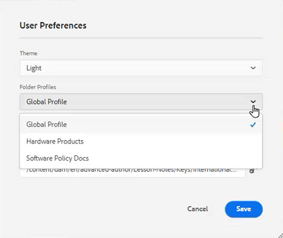
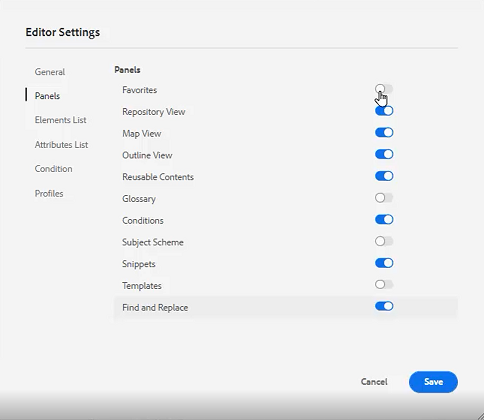
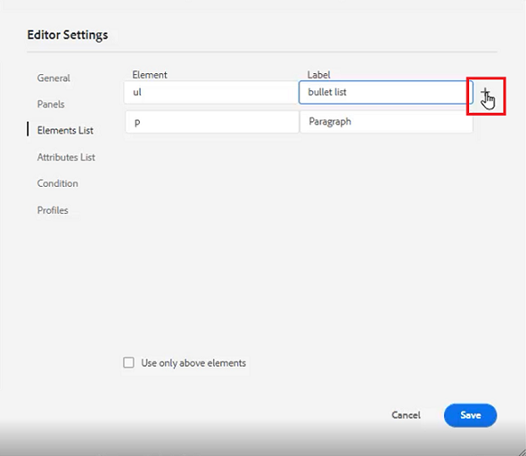

# Användarinställningar, redigeringsinställningar och redigeringsverktygsfält

Redigeraren har ett mycket konfigurerbart gränssnitt. Blandningen av användarinställningar, redigeringsinställningar och mappprofiler innebär att du kan anpassa nästan alla aspekter av din arbetsmiljö.

>[!VIDEO](https://video.tv.adobe.com/v/342769?quality=12&learn=on)

## Visa eller dölj elementtaggar

Taggar är visuella tecken som anger ett elements gränser. En elementgräns markerar början och slutet av ett element. Du kan sedan använda dessa gränser som en visuell referenspunkt för att placera insättningspunkten eller markera texten inom en gräns.

1. Klicka på ikonen [!UICONTROL **Växla taggvy**] i det sekundära verktygsfältet.

   

   Taggar visas i avsnittet. Med taggvyn kan du:

   - Markera innehållet i ett element genom att klicka på den inledande eller avslutande taggen.

   - Expandera eller komprimera taggar genom att klicka på tecknet + eller - i taggen.

   - Använd snabbmenyn för att klippa ut, kopiera eller förbi det markerade elementet.

   - Dra och släpp element genom att markera taggen och släppa elementet på en giltig plats.

1. Klicka på ikonen [!UICONTROL **Växla taggvy**] igen om du vill dölja taggarna.

Taggar försvinner så att du kan fokusera på texten.

## Lås resurser när de används

Genom att låsa (eller checka ut) en fil får användaren exklusiv skrivåtkomst till filen. När filen är olåst (eller incheckad) sparas ändringarna i den aktuella versionen av filen.

1. Klicka på ikonen [!UICONTROL **Lås**] i det sekundära verktygsfältet.

   

   Filen har checkats ut och en låsikon visas bredvid filnamnet i databasen.

1. Klicka på ikonen [!UICONTROL **Lås upp**] .

   

Databasen uppdateras och visar att filen har checkats in.

## Infoga specialtecken

1. Klicka på ikonen [!UICONTROL **Infoga specialtecken**] i det sekundära verktygsfältet.

   

1. I dialogrutan Infoga specialtecken skriver du namnet på tecknet i sökfältet.

   Du kan också använda listrutan Välj kategori för att visa alla tecken i en viss kategori.

1. Markera önskat tecken.

1. Klicka på [!UICONTROL **Infoga**].

Specialtecknet infogas i texten.

## Växla mellan redigeringsläge, Source- och förhandsgranskningsläge

Med verktygsfältet längst upp till höger på skärmen kan du växla mellan vyer.

- Välj **Författare** om du vill visa strukturen och innehållet när du arbetar med ett ämne.

- Välj **Source** om du vill visa den underliggande XML-koden som ämnet består av.

- Välj **Förhandsgranska** om du vill visa hur ett ämne visas när det visas av en användare i webbläsaren.

## Ändra temat med användarinställningar

Du kan välja mellan ljusa och mörka teman för redigeraren. Med hjälp av temat Ljus använder verktygsfälten och panelerna en ljusgrå bakgrund. När du använder det mörka temat används en svart bakgrund i verktygsfälten och panelerna. I båda temana visas området för innehållsredigering med en vit bakgrund.

1. Klicka på ikonen [!UICONTROL **Användarinställningar**] i det övre verktygsfältet.

   

1. Klicka på listrutan [!UICONTROL **Tema**] i dialogrutan Användarinställningar.

1. Välj bland de tillgängliga alternativen.

   

1. Klicka på [!UICONTROL **Spara**].

Redigeraren uppdateras för att visa det tema du föredrar.

## Uppdatera bassökvägen med användarinställningar

Du kan uppdatera bassökvägen så att databasvyn visar innehållet från en viss plats så fort du startar Redigeraren. Detta minskar tiden för åtkomst till arbetsfiler.

1. Klicka på ikonen [!UICONTROL **Användarinställningar**] i det övre verktygsfältet.

   

1. I dialogrutan Användarinställningar klickar du på ikonen [!UICONTROL **Mapp**] bredvid bassökvägen.

   

1. I dialogrutan Välj sökväg klickar du på kryssrutan bredvid en viss mapp.

1. Klicka på [!UICONTROL **Markera**].

Nästa gång du startar Redigeraren visar databasen de filer som har angetts i grundsökvägen.

## Tilldela en ny mappprofil

Den globala profilen är systemstandard. Administratörer kan skapa ytterligare mappprofiler att välja mellan.

1. Klicka på ikonen [!UICONTROL **Användarinställningar**] i det övre verktygsfältet.

   

1. Klicka på listrutan [!UICONTROL **Mappprofiler**] i dialogrutan Användarinställningar.

   

1. Välj en profil bland de tillgängliga alternativen.

1. Klicka på [!UICONTROL **Spara**].

Den nya mappprofilen har nu tilldelats. Verktygsfältsalternativen, visningslägena och Villkor och fragment har ändrats i den vänstra panelen. Det kan också ändra utseendet på innehållet i redigeraren.

## Ändra ordlistan med redigeringsinställningarna

Redigeringsinställningarna är tillgängliga för administrativa användare. Med de här inställningarna kan du konfigurera ett intervall med inställningar, varav ett är det lexikon som används i redigeraren för stavningskontroll.

1. Klicka på ikonen [!UICONTROL **Inställningar för redigerare**] i det övre verktygsfältet.

   

1. Klicka på fliken [!UICONTROL **Allmänt**] i dialogrutan Redigeringsinställningar.

1. Välj det lexikon du vill arbeta med.

1. Klicka på [!UICONTROL **Spara**].

Ordlistan uppdateras. Observera att när du växlar till AEM stavningskontroll kan du använda en anpassad ordlista.

## Visa och dölja paneler med redigeringsinställningarna

En av de funktioner som du kan anpassa med redigeringsinställningarna är paneler. Mer specifikt kan du välja vilka paneler som ska visas eller döljas i redigeraren.

1. Klicka på ikonen [!UICONTROL **Inställningar för redigerare**] i det övre verktygsfältet.

   

1. Klicka på fliken [!UICONTROL **Paneler**] i dialogrutan Redigeringsinställningar.

1. Växla de tillgängliga panelerna till Visa eller Dölj efter behov.

   

1. Klicka på [!UICONTROL **Spara**].

Den vänstra panelen är nu konfigurerad att endast visa paneler som är växlade till Visa.

## Namnge och etikettera element i redigeringsinställningarna

Med Elements List kan du namnge ett specifikt element och tilldela det en mer användarvänlig etikett. Elementnamnet ska vara ett av DITA-elementen. Etiketten kan vara vilken sträng som helst.

1. Klicka på ikonen [!UICONTROL **Inställningar för redigerare**] i det övre verktygsfältet.

   

1. Klicka på fliken [!UICONTROL **Elementlista**] i dialogrutan Redigeringsinställningar.

1. Skriv ett **elementnamn** och en **etikett** i respektive fält.

1. Klicka på ikonen [!UICONTROL **Plus**] om du vill lägga till fler element i listan.

   

1. Klicka på [!UICONTROL **Spara**].

Du kan omedelbart se ändringen i Elements-listan i de befintliga taggarna i redigeraren. Du kan även se dem i alternativen som visas när du lägger till ett nytt element.

## Namn- och etikettattribut i redigeringsinställningarna

Attributlistan fungerar på ungefär samma sätt som elementlistan. I redigeringsinställningarna kan du styra attributlistan och deras visningsnamn.

1. Klicka på ikonen [!UICONTROL **Inställningar för redigerare**] i det övre verktygsfältet.

   

1. Klicka på fliken [!UICONTROL **Attributlista**] i dialogrutan Redigeringsinställningar.

1. Skriv ett **attributnamn** och en **etikett** i respektive fält.

1. Klicka på ikonen [!UICONTROL **Plus**] om du vill lägga till fler attribut i listan.

## Konfigurera villkor i redigeringsinställningarna

På fliken Villkor kan du konfigurera flera egenskaper.

1. Klicka på ikonen [!UICONTROL **Inställningar för redigerare**] i det övre verktygsfältet.

   

1. Klicka på fliken [!UICONTROL **Villkor**] i dialogrutan Redigeringsinställningar.

1. Markera kryssrutorna för de villkor som du vill använda.

   

1. Klicka på [!UICONTROL **Spara**].

## Skapa en publiceringsprofil i redigeringsinställningarna

Publish-profiler kan användas för att publicera kunskapsbasen. Salesforce använder till exempel en konfigurerad app med en konsumentnyckel och en konsumenthemlighet. Den här informationen kan användas för att skapa en Salesforce-publiceringsprofil.

1. Klicka på ikonen [!UICONTROL **Inställningar för redigerare**] i det övre verktygsfältet.

   

1. Klicka på fliken [!UICONTROL **Profiler**] i dialogrutan Redigeringsinställningar.

1. Klicka på ikonen [!UICONTROL **Plus**] bredvid Profiler.

1. Fyll i fälten efter behov.

1. Klicka på [!UICONTROL **Spara**].

En publiceringsprofil har skapats.
